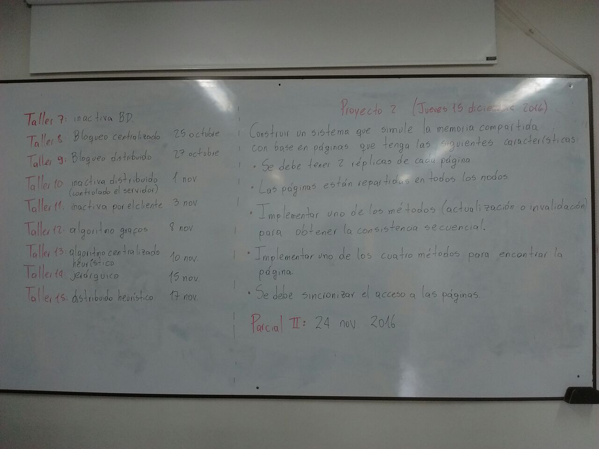

# Asignatura Sistemas Distribuidos

## Dependencias:
* Python

## Ejercicios
1. Sockets Localhost
2. Sockets Red
3. RPC
4. Comunicación Grupal
5. UDP - Servidores de operaciones independientes
6. RPC - Servidores de operaciones independientes
7. Registro de procesos en un archivo BD

### Proyecto I
1. Berkeley algorithm
2. Cristian's algorithm

### Proyecto II

